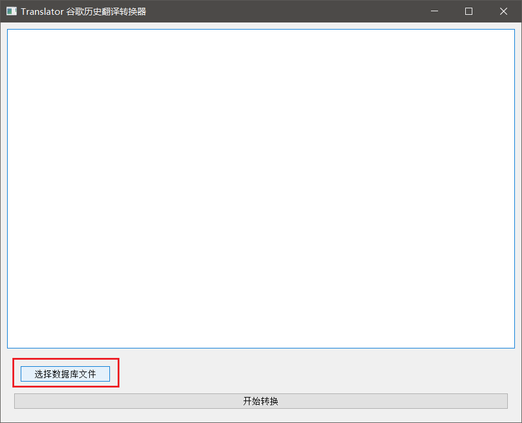
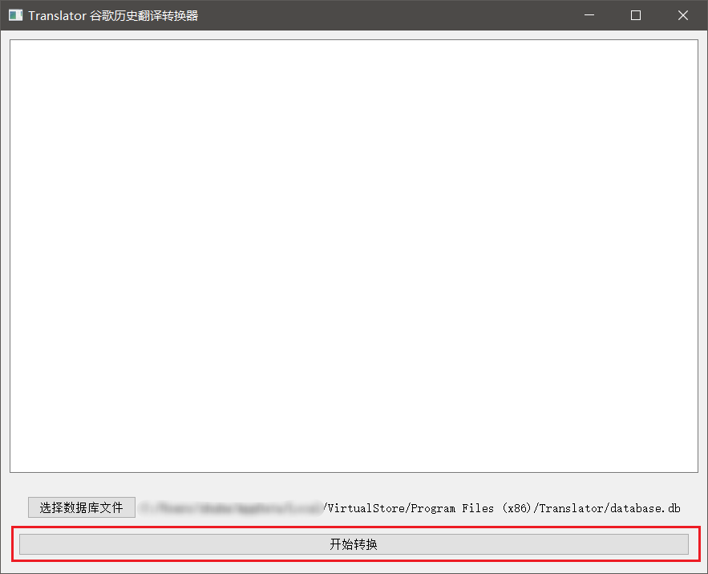

# 鸣谢

软件使用：

有道智云AI开放平台；

百度开放平台；

谷歌翻译；

搜狗深智引擎；

腾讯云

平台的翻译 API。

感谢这些公司提供的 API 接口，你们为我们沟通世界提供了桥梁，你们提供的知识为人类发展做出了杰出的贡献。

都说书山有路勤为径，但若书山路上遍布荆棘，勤也无济于事，感谢你们提供的技术，为我们书山之旅披荆斩棘！

# 免责声明

本软件只做学习交流使用，不可用于商业用途！

软件使用的主要接口来自于各个平台提供的合法 API，但也存在几个未得到授权的 API 接口，其中包含：
- 谷歌翻译 API
- 谷歌翻译语音 API
- 百度翻译语音 API
- 有道翻译语音 API

软件为开源非商业软件，用户如果使用以上 API 相关的功能产生的法律问题均与作者本人无关。

以上公司如果认为软件有侵犯自己的合法权益，请告知作者(zhuhelong@foxmail.com)，作者将立即删除相关代码。

# 关于报毒

由于使用了鼠标和键盘钩子但是没有购买数字签名（太贵，买不起），软件会被 Windows Defender 报毒，不放心的小伙伴可以使用火绒等杀毒软件查杀。

软件使用以最低权限运行，只有安装程序需要获取高一些的权限，因为要写入到 Program Files(x86) 文件夹，因为要使用低权限运行，所以没有在安装完后运行软件。

# 更新历史

## 2021年9月23日 版本：V1.1.0

1. Google 翻译 API 变更；

2. Google 语音 API 变更；

3. 为避免 Google 再次出现这种问题，添加了一层自定义 Google 翻译数据结构；

   ```javascript
   // Google 自定义数据结构
   const dataStructure = {
       // 源语言
       fromLanguage: null,
       // 目标语言
       toLanguage: null,
       // 源文
       sourceText: null,
       // 释义
       paraphrase: null,
       // 源文读音
       sourceTextPronunciation: null,
       // 译文读音
       paraphrasePronunciation: null,
       // 词性列表
       partOfSpeechList: [{
           // 词性
           partOfSpeech: null,
           // 该词性下的释义列表
           paraphraseList: [{
               // 释义
               paraphrase: null,
               // 该释义的使用频率
               usageFrequency: 0.1,
               // 该词性下的释义对应的近义词
               synonymList: [null],
           }],
       }],
       // 定义列表，，包含同义词
       definitionList: [{
           // 词性
           partOfSpeech: null,
           // 该词性下的定义
           definitionList: {
               // 英文定义
               definition: null,
               // 例句
               exampleSentence: null,
               // 该定义下的同义词列表
               synonymList: [null],
               // 非正式同义词
               otherSynonym: {
                   // 非正式同义词性质
                   nature: null,
                   // 该非正式同义词下的同义词列表
                   list: [null],
               },
           }
       }],
       // 例句
       exampleSentenceList: [null],
   };
   ```


4. 新增开发 Google 历史数据转换工具，其可将旧 Google 数据结构转新 Google 自定义数据结构，使用说明请看附录（**注：请做好数据备份！！！软件所有数据都存于 database.db 中！！！如果大家还需要历史数据，请务必先使用 Google 历史数据转换工具后，再安装 Translator V1.1.0。新用户请忽略。新版 Translator 不支持旧 Google 数据，如果还需要旧数据，则使用 Google 历史数据转换工具进行转换，如果不需要，在遇到历史数据错误时，使用 Ctrl + Enter 进行网络请求更新数据。**）；
5. Google 翻译 UI 有细微调整，具体包括：① 词性后不列出所有词义；② 定义的例句前添加 `e.g.` 前缀以表示其为例句；③ 同义词位于定义的例句后，不再单独列出。


# 图标

使用 Jokerman 字体渲染的字母 “T” 作为本软件的图标。

感谢 Jokerman 字体的制作者 **Andrew Smith** 创造出如此极富美感、明快活泼的字体。

# 初衷

作者很早以前一直使用[灵格斯](http://www.lingoes.cn/)，简单，易用，当时写代码还没有遇上特别多需要命名的时候。后来，灵格斯不再维护，导致后面无法使用，作者只好另寻其他替代软件，但是找了很久没有找到。作者要求很简单，无广告，可翻译，可读音，能识别驼峰法、下划线法、减号法命名格式的词句，能生成代码命名格式。找了很久没有找到，然后作者自己做了一个桌面小应用，也是使用 Qt 制作，总的代码 300 多行，一直使用着，可是功能太简单，想把它优化一下的想法一直在我脑中。后来发现了 IDEA 中有一款插件有这些功能，但是不好弄成桌面应用，还是自己做吧。后来一发不可收拾，功能越做越多，总算做出来了，回头看看，也是值得的吧。

可能有些功能还不完善，或者有 Bug，大家有问题请指出，作者有空的话考虑修改。

为方便交流，有问题的请加 QQ 群。

// TODO

只希望大家用的开心~

# 术语

名词解释前提：

1. 文件管理器中文件拓展名可见。

| 名词             | 解释                                                         | 备注                                                         |
| ---------------- | ------------------------------------------------------------ | ------------------------------------------------------------ |
| 安装目录         | Translator.exe 文件（也可能是 `Translator` 文件，*nix 下）所在目录 |                                                              |
| 用户数据库文件   | 安装目录下软件第一次启动后创建的 `database.db` 文件          | 移植时很重要<br />如果安装在 Program Files (x86)文件夹下，则可能在 User目录/AppData/Local/VirtualStore/Program Files(x86)/Tranalstor 中 |
| JS 调试输出目录  | 安装目录下 response_content 文件夹                           | 里面文件是请求平台后的响应内容，<br />如果要调试 JS 程序或主题，则可以选择输出。<br />如果安装在 Program Files (x86)文件夹下，则可能在 User目录/AppData/Local/VirtualStore/Program Files(x86)/Tranalstor 中 |
| 读音文件输出目录 | 安装目录下 pronunciation 文件夹                              | 如果安装在 Program Files (x86)文件夹下，则可能在 User目录/AppData/Local/VirtualStore/Program Files(x86)/Tranalstor 中 |
| Log 文件目录     | 安装目录下 log 文件夹                                        | 如果安装在 Program Files (x86)文件夹下，则可能在 User目录/AppData/Local/VirtualStore/Program Files(x86)/Tranalstor 中 |
| 主题目录         | 安装目录下 theme 文件夹                                      |                                                              |
| JS 程序目录      | 安装目录下 js_program 文件夹                                 |                                                              |
| 源文             | 用户输入的需要翻译的文本                                     |                                                              |
| 译文             | 软件从平台请求回来的翻译内容                                 |                                                              |
| 源语言           | 源文内容的语种                                               |                                                              |
| 目标语言         | 需要翻译成的语种                                             |                                                              |
| HTML译文         | 译文经过 JS 程序处理后渲染到主界面的 HTML 文本               |                                                              |
| 主界面聚焦       | 主界面处在激活的状态。                                       |                                                              |
| 输入框聚焦       | 主界面输入框内有光标在闪烁                                   |                                                              |
| 翻译公司         | 提供翻译 API 的公司                                          |                                                              |
| 释义框           | 指显示各个翻译公司释义的显示框                               |                                                              |

# 功能排期

注：斜体代表还在征集大家的意见，粗体代表正在实现，中划线代表以作者现有实力暂时无法完成，无样式代表排期中。

- [ ] **重构。**
- [ ] 收藏单词的显示有时候很混乱。比如，收藏单词 happy，单词显示为收藏状态（绿色字体），随意输入字符，然后删除所有字符，此时 happy 不显示收藏状态了。
- [ ] Anki 要导出成文件才能导入到 Anki 中，太麻烦了，尝试与 [[anki-sync-server](https://github.com/tsudoko/anki-sync-server)](https://github.com/tsudoko/anki-sync-server) 整合。
- [ ] 设置界面在低分辨率下不友好，做成使用 Tab Widget 的形式会好一些。
- [ ] 设置可以多行自动变单行（在翻译 PDF 文档时很有作用，即换行变空格）。
- [ ] 做成可以设置收藏时自动下载读音文件。
- [ ] 普通翻译与程序员翻译的快速转换，比如 普通翻译 使用 tab 键，程序员翻译使用 Alt 键。
- [ ] 适配 Ubuntu，用的少，慢慢来。
- [ ] 快捷键切换读音公司和命名公司。
- [ ] ~~适配 Mac（作者没有苹果电脑，穷~）。~~
- [ ] *将 `←` 键功能替换为复制上一次翻译的文本。*

# 初次使用

## Windows 中初次使用

### 安装

#### 使用安装程序

双击 `Translator_Setup.exe` 文件打开安装程序。依据提示安装软件。

#### 使用压缩包安装

1. 将压缩包内的所有文件解压至有访问权限的目录中；
2. 进入到解压目录中，找到 `Translator.exe` 文件（也可能是 `Translator` 文件），右击该文件，菜单中移动鼠标到 `发送到`，在弹出的菜单中左击 `桌面快捷方式`。

## 启动软件

双击桌面图标，启动后在任务栏小图标列表中可以看到程序图标（如果没有，看看是不是被收起来了）。


## 打开主界面

使用快捷键 `Crtl  + Shift + Alt + 0`（注意是数字 0）打开软件主界面。

或使用[自定义快捷键](#修改显示隐藏主界面快捷键)打开。


## 打开&关闭关于对话框

在软件主界面使用快捷键 `Ctrl + I` 或右击任务栏小图标后在弹出的菜单中点击 `关于` 打开关于对话框。通过 `Esc` 快捷键关闭对话框。

注：Ctrl + <u>I</u>nformation。


## 打开&关闭设置对话框

在软件主界面使用快捷键 `Ctrl + O` 或右击任务栏小图标后在弹出的菜单中点击 `选项设置` 打开设置对话框。通过 `Esc` 快捷键关闭对话框。

注1：Ctrl + <u>O</u>ptions。

注2：设置不需要保存，直接使用 `Esc` 退出即可。


## 打开&关闭单词本对话框

在软件主界面使用快捷键 `Ctrl + B` 或右击任务栏小图标后在弹出的菜单中点击 `单词本` 打开单词本对话框。通过 `Esc` 快捷键关闭对话框。

注：Ctrl + <u>B</u>ook。


## 打开导出至 Anki 对话框

在软件主界面使用快捷键 `Ctrl + E` 或右击任务栏小图标后在弹出的菜单中点击 `导出至 Anki` 打开导出至 Anki 对话框。通过 `Esc` 快捷键关闭对话框。

注：Ctrl + <u>E</u>xport。


## 关闭关于对话框、设置对话框、单词本对话框、导出至 Anki 对话框

通过 `Esc` 快捷键关闭以上对话框。

注：以上对话框中没有关闭按钮，只能通过 `Esc` 快捷键关闭。

## 隐藏主界面

隐藏主界面有3种方式。

### 通过设置的快捷键隐藏

通过设置的快捷键隐藏，默认为：Crtl  + Shift + Alt + 0（注意是数字 0），当主界面显示且输入框获得焦点时（即输入框内有光标闪烁），主界面会隐藏，**当主界面显示且输入框未获得焦点时，通过快捷键会使输入框获得焦点**。


### 通过鼠标移动到主界面所在屏幕的角落隐藏

通过鼠标移动到主界面所在屏幕的角落隐藏主界面，默认鼠标相对左上，左下，右上，右下角10各像素时，主界面隐藏，可在设置界面中设置这些参数。


### Esc 快捷键

或是主界面聚焦的情况下通过 Esc 隐藏。


## 配置各平台 API 的 Key 和 密钥

打开设置界面，在各个公司的配置框中填写相应的配置。


### 启用谷歌翻译

在设置界面中选上谷歌翻译框中的 `是否启用`，即完成了谷歌翻译的配置。

### 获取百度开放平台 API 的 APP ID 和 密钥并启用百度翻译

1. [注册百度账号](https://passport.baidu.com/v2/?reg)，如果有百度账号则可以跳过这一步；
2. [登录百度账号](https://passport.baidu.com/v2/?login)；
3. 打开[注册成为百度翻译开发者页面](https://fanyi-api.baidu.com/api/trans/product/apiapply)，按要求填写信息并提交，可以按自己需要选择高级版或免费版，最后点击 `开通服务`；
4. 选择 `通用翻译API`，下一步，按要求填写相关信息，应用名称可以填写 `Translator`，其他可以不填，提交后即开通成功。
5. 打开[开发者信息页面](https://fanyi-api.baidu.com/api/trans/product/desktop?req=developer)，即可看到 `APP ID` 和 `密钥`，将这两项信息填入设置界面中对应的百度 `APP ID` 和 `密钥` 输入框中；
6. 选上百度翻译框中的 `是否启用`，完成百度开放平台的配置。

### 获取有道智云AI开放平台 API 的 Key 和 密钥并启用百度翻译

1. [注册有道智云账号](https://ai.youdao.com/register.s)；如果有有道智云账号则可以跳过这一步；
2. 登录后可以发现赠送了 50 元体验金，如果加了客服微信，还可以再赠送 50 元；
3. 打开[我的应用页面](https://ai.youdao.com/appmgr.s)，点击创建应用，按要求填写相关信息，应用名称可以填写 `Translator`，应用类别选择 `实用工具`，接入方式选择 `API`，点击下一步，点击创建应用；
4. 打开[翻译实例页面](https://ai.youdao.com/fanyi-services.s)，点击创建实例，实例名称可以填写 `Translator实例`，实例类型选择 `文本翻译`，下一步，完成创建；
5. 打开[我的应用页面](https://ai.youdao.com/appmgr.s)，点击创建的应用，这个时候可以看到 `应用ID` 和 `应用密钥`，将这两项信息填入设置界面中对应的有道翻译 `应用ID` 和 `应用密钥` 输入框中，然后点击绑定服务，勾选你创建的实例，点击确定，最后**点击修改**；
6. 选上有道翻译框中的 `是否启用`，完成有道智云AI开放平台的配置。

### 获取腾讯云 API 的 SecretId 和 SecretKey 并启用腾讯翻译君

1. 使用微信登录[腾讯云](https://cloud.tencent.com/login)，并注册好账号；接着实名认证；
2. 打开[机器翻译页面](https://console.cloud.tencent.com/tmt)，选上 `我已阅读并同意《服务等级协议》` 然后点击 `免费试用`；
3. 打开[云 API 密钥页面](https://console.cloud.tencent.com/cam/capi)，在高风险提示弹出框中点击 `继续使用`，然后点击 `新建密钥`；
4. 这个时候可以看到 `SecretId` 和 `SecretKey`（需要微信扫码验证），将这两项信息填入设置界面中对应的腾讯翻译 `SecretId` 和 `SecretKey` 输入框中；
5. 选上腾讯翻译君框中的 `是否启用`，完成腾讯云平台的配置。

### 获取搜狗深智引擎 API 的 PID 和 Key 并启用搜狗翻译

1. [注册搜狗深智引擎账号](https://deepi.sogou.com/register/register)，个人信息完善中选择 `个人`，服务需求选择 `文本翻译`，产品名称可以填写 `Translator`，其他按要求填写并提交，搜狗赠送了 100元代金券，这 100元代金券可用于中英互译，其他翻译另外收费；
2. 打开[文本翻译页面](https://deepi.sogou.com/registered/texttranslate)，在线获取PID&KEY 框中点击 `点击获取` 按钮；
3. 这个时候可以看到 `PID` 和 `Key`，将这两项信息填入设置界面中对应的腾讯翻译 `PID` 和 `Key` 输入框中；
4. 选上搜狗翻译框中的 `是否启用`，完成搜狗深智引擎的配置。

### 启用笔记功能

在设置界面中选上笔记框中的 `是否启用`，即完成了笔记的配置。

# 普通功能列表

软件的常规功能。

## 普通翻译

在主界面欢迎使用输入框中输入需要翻译的内容，选择好源语言和目标语言，按下 `Tab` 键开始翻译。

当开始翻译后，每个翻译公司的释义显示框上方会出现请求进度条。请求完毕后会自动隐藏。

注1：在普通翻译模式下，如果源语言选择为 `自动检测`，则翻译时会使用各个平台自己的自动检测功能。

注2：如果某公司不支持源语言或目标语言，则会显示不支持语言。


## 翻译历史词句

在词句请求翻译公司翻译过一次后，译文即会保存至 `用户数据库文件` 中，再次翻译相同内容（相同内容必须包括以下都相同：翻译公司，源文，源语言，目标语言），则会直接使用数据库中的译文。

注：`自动检测` 也属于一种源语言。比如，翻译 `hello`，先设置源语言为 `自动检测` 翻译了一次，再将源语言设置为 `英语` 后翻译，因为源语言的不同，软件还会再次请求翻译公司，也将导致用户翻译历史可能出现两条类似的翻译。

说明：为什么这么设计？因为各个平台的 `自动检测` 功能并不是每次检测相同源文得到的源语言都是一致的。比如：翻译 `DENO`，源语言设置为 `自动检测`，目标语言设置为 `中文`，会发现百度翻译识别为 `世界语`， 谷歌识别为 `日语`，有道翻译设别为 `葡萄牙语`，腾讯翻译君识别为 `德语`，搜狗翻译识别为 `英语`。


## 词句读音

当开始请求读音时，当读音需要从网络下载时，会有蓝色的进度条显示下载进度，请求完毕后会自动隐藏。当播放读音时，播放进度条是绿色的。

注：设置中读音来源公司需正确配置且启用才能正常使用谷歌翻译。比如，设置中读音来源选择的是百度翻译，但是百度翻译未正确配置或启用，则在主界面中是无法显示百度翻译的，那也就无法播放正确的读音。


### 源文读音

在主界面输入框没有内容的情况下，按下 `Tab` 或 `Ctrl + Enter` 键播放当前显示在主界面中的源文的读音。

### 译文读音

在主界面输入框没有内容的情况下，按下 `Enter` 键播放当前显示在主界面中的译文的读音。

## 回溯翻译历史

在主界面输入框没有内容的情况下，按 `↑` 键和 `↓` 键分别回溯翻译历史的前一个和后一个。


## 收藏翻译内容 & 取消收藏翻译内容

在主界面按下 `Ctrl + S` 即可收藏当前显示在主界面中的翻译到单词本。此时单词会变为绿色（在使用默认主题的情况下）。

在主界面按下 `Ctrl + D` 即可取消收藏当前显示在主界面中的翻译。


## 查看收藏的词句列表

打开单词本界面，选择 `显示收藏的内容` 即可看到收藏的翻译内容，同时可以通过翻页按钮查看上下页，双击条目可在主界面中显示。

## 查看翻译历史

打开单词本界面，选择 `显示翻译历史记录` 即可看到收藏的翻译内容，同时可以通过翻页按钮查看上下页，双击条目可在主界面中显示。

## 交换源语言与目标语言

在某些情况下，需要频繁交换源语言与目标语言，此时可以使用快捷键 `Ctrl + J ` 或点击主界面源语言与目标语言选择框中间的 `译` 按钮。

注：当源语言为 `自动检测` 时，无法交换源语言与目标语言。


## 重新输入

在主界面输入框没有内容的情况下，按 `→` 键重新输入上一次翻译的文本。


## 粘贴剪切板的内容

在主界面输入框没有内容的情况下，按 `←` 键粘贴剪切板中的内容，与 Ctrl + V 功能一致。

**作者考虑将 `←` 键功能替换为复制上一次翻译的文本。**

## 导出至 Anki

打开导出至 Anki 对话框。根据需求填写表单，点击开始导出即可。

注1：读音由百度，谷歌，有道，搜狗提供，如果导出的源文有多个读音，则会按照 `翻译框显示顺序` 列表列出的公司顺序来选择可用的读音。

注2：同一源文，导出相同的几个公司，且翻译框显示顺序没有改变，即导出的内容没有变化，则导入 Anki 时不会覆盖 Anki 中相同的内容。

## 开机启动

在设置对话框中勾选 `开机启动` 即可。

## 设置主界面显示位置以及宽高

在设置对话框中 `主界面几何` 中，选择相对屏幕哪个角显示，可选的选项有 `左上`，`左下`，`右上`，`右下`，当水平位置选择靠左显示时，是以主界面的左边界线相对屏幕，靠右显示时，则是以主界面的右边界线相对屏幕；垂直位置的上下同理。在设置对话框中 `主界面几何` 中，相对距离 X 指水平位置相对的距离，Y 指垂直距离相对的位置。

在设置对话框中 `主界面几何` 中，主界面大小的宽高用以设置主界面大小。

## 设置主界面输入框最大输入行数

在设置对话框中 `输入框最大输入行数` 中设置主界面输入框最大输入行数。

注：一旦主界面输入框内容行数超出 `输入框最大输入行数`，则输入框中会出现滚动条。有此设置是为了满足界面的美观。

## 设置释义显示框最大高度

在设置对话框中 `释义显示框最大高度` 中设置主界面中的释义显示框最大显示高度。

注：释义框内容高度小于  `释义显示框最大高度` 时释义框会自适应高度，如果大于，则显示滚动条。

## 修改主题

在设置对话框中 `主题` 中选择切换软件主题。

注：切换主题后，软件会重启，主界面不会自动显示，要重新打开主界面。

## 修改显示隐藏主界面快捷键

在设置对话框中 `显示隐藏主界面` 中修改显示隐藏主界面的快捷键。

注：作者本人喜欢 `Ctrl + T` 快捷键，平时翻译时， `Ctrl + C`， `Ctrl + T`， `Ctrl + V` 一套组合。当有对话框显示时，鼠标移动到角落不会触发隐藏主界面动作。

## 修改鼠标隐藏主界面的参数

在设置对话框中 `鼠标隐藏主界面` 中修改鼠标隐藏主界面的各项参数。

距离角落像素：当鼠标距离角落多少个像素时，主界面隐藏。注：使用的是切比雪夫距离，不是欧式距离（基于性能的考量）。该参数可设置的原因是，在不同分辨率上该参数需要不同的值以获得更好的用户体验。

鼠标移动到哪些角落时隐藏主界面：鼠标距离屏幕的哪些角落会触发隐藏主界面动作。

注：当有对话框显示时，鼠标移动到角落不会触发隐藏主界面动作。

## 设置播放读音时的音量

在设置对话框中 `音量` 中修改播放读音时的音量。

注：当读音需要从网络下载时，会有蓝色的进度条显示下载进度，当播放读音时，播放进度条是绿色的。

## 设置记录本每页条数

在设置对话框中 `记录本每页条数` 中修改记录本每页显示条数。

注：默认每页加载 100 条，这个值应根据电脑配置调整。不建议太大。

## 设置网络请求超时时间

在设置对话框中 `网络请求超时时间` 中修改网络请求超时时间。

注：网络超时时间默认为 5 秒，如果设置太大，网络有问题的时候会造成长时间加载不出数据，建议根据网络情况设置合适的值。

## 修改读音来源公司

在设置对话框中 `读音来源` 中修改读音来源公司。

注：请求到的数据会存入读音文件输出目录，除非删除了读音文件输出目录中对应的内容，不然请求同一内容和同一公司的读音，只会请求一次。

## 修改语言检测器

在设置对话框中 `语言检测` 中修改语言检测器，包含百度翻译语言检测器，谷歌翻译语言检测器，自定义语言检测器。

注1：`自定义语言检测器` 代码位于 `JS 程序目录/公共.js:detectLanguage` 中。

注2：JS 支持的语法为  [ECMA-262](http://www.ecma-international.org/publications/standards/Ecma-262.htm) 标准。

## 修改首选目标语言

在设置对话框中 `首选目标语言` 中修改首选目标语言。

注：首选目标语言分为第一首选目标语言和第二首选目标语言，分别对应 `首选目标语言` 中两个下拉框，前者为第一首选目标语言。

## 关闭主界面选择语言栏

使用 `Ctrl + L` 开启或关闭主界面选择语言栏。

注1：Ctrl + <u>L</u>anguage。

注2：关闭主界面选择语言栏后，软件启用语言检测器，语言检测器检测源文，检测到的源语言如果和第一首选目标语言不同，目标语言将会被设置为第一首选目标语言，如果源语言如果和第一首选目标语言相同，则目标语言设置为第二首选目标语言。比如：第一首选目标语言设置为“中文”，第二首选目标语言设置为“英语”。要翻译“你好”这个词，检测器检测到源文为中文，则会设置目标语言为英语；要翻译 hello 这个单词，检测器检测到源文为英语，则会设置目标语言为中文。

## 设置翻译框显示顺序

在设置对话框中 `翻译框显示顺序` 中拖动各个公司以改变显示顺序。

注：拖动后主界面不会立即响应，需要退出设置对话框才能看到效果。

# 高阶功能列表

这些功能需要有编程需求或者编程能力的用户才能使用。

## 设置输出请求到的内容

在设置对话框中勾选 `输出请求到的内容` 以输出请求到的内容。

注：此功能用以调试用，内容会输出至 `JS 调试输出目录`，文件名以 `公司名-源文.ejs` 命名，为什么不以 `js` 为后缀，要以 `ejs` 为后缀，是因为如果以 `js` 是会被 Windows 限制输出。

## 命名模式

### 功能

使用 `Ctrl + N` 开启命名功能（也叫程序员模式）。此时主界面底部出现6个按钮，分别对应小写驼峰法命名，大写驼峰法命名，小写下划线命名，大写下划线命名，小写减号命名，大写减号命名。


注1：Ctrl + <u>N</u>ame。

注2：命名功能适用于写代码人员，开启后，输入框内可识别驼峰法、下划线法、减号法命名格式的词句（会过滤掉特殊字符）。

注3：当按钮中有文字时，通过点击按钮或使用 Ctrl + 1/2/3/4/5/6 或 F1，F2，F3，F4，F5，F6 复制按钮中的内容。

注4：开启程序员模式后，主界面目标语言下拉框会被禁用，目标语言设为设置中的首选目标语言中的两个语言。

注5：只有当源文或译文被识别为英语时才会将源文或译文进行命名处理。

注6：多行文本下，也可以进行命名，多个命名会以 `\n` 分割，所以按钮中只会显示第一行的文本。

### 修改命名来源公司

在设置对话框中 `命名来源` 中修改命名来源公司。

注：命名来源公司需启用才能使用命名模式。


## 设置命名需要过滤的单词

在设置对话框中 `命名需要过滤的单词` 中添加单词。

命名过滤单词，使用 `,` 隔开需要过滤的单词，这些单词不会出现在命名中。

## 修改自定义语言检测器

`自定义语言检测器` 代码位于 `JS 程序目录/公共.js:detectLanguage` 中。方法签名为 `String detectLanguage(String words)`，如果需要修改自定义语言检测器，则修改该方法内的代码即可，返回的 String 需是以下语言名称。

```
中文, 英语, 中文(繁体), 日语, 韩语, 俄语, 法语, 德语, 粤语, 文言文, 阿尔巴尼亚语, 阿尔及利亚阿拉伯语, 阿肯语, 阿拉伯语,
阿拉贡语, 阿姆哈拉语, 阿萨姆语, 阿塞拜疆语, 阿斯图里亚斯语, 艾马拉语, 爱尔兰语, 爱沙尼亚语, 奥杰布瓦语, 奥克语, 奥里亚语,
奥罗莫语, 奥塞梯语, 巴什基尔语, 巴斯克语, 巴西葡萄牙语, 白俄罗斯语, 白苗语, 柏柏尔语, 邦板牙语, 保加利亚语, 北方萨米语,
北索托语, 本巴语, 比林语, 比斯拉马语, 俾路支语, 冰岛语, 波兰语, 波斯尼亚语, 波斯语, 博杰普尔语, 布列塔尼语, 楚瓦什语,
聪加语, 鞑靼语, 丹麦语, 掸语, 德顿语, 低地德语, 迪维希语, 法罗语, 梵语, 菲律宾语, 斐济语, 芬兰语, 弗里西语, 弗留利语,
富拉尼语, 刚果语, 高地索布语, 高棉语, 格陵兰语, 格鲁吉亚语, 古吉拉特语, 古希腊语, 古英语, 瓜拉尼语, 哈卡钦语, 哈萨克语,
海地克里奥尔语, 豪萨语, 荷兰语, 黑山语, 胡帕语, 吉尔吉斯语, 加利西亚语, 加拿大法语, 加泰罗尼亚语, 捷克语, 卡拜尔语,
卡纳达语, 卡努里语, 卡舒比语, 康瓦尔语, 科西嘉语, 克雷塔罗奥托米语, 克里克语, 克里米亚鞑靼语, 克林贡语, 克林贡语(piqaD),
克罗地亚语, 克丘亚语, 克什米尔语, 孔卡尼语, 库尔德语, 拉丁语, 拉特加莱语, 拉脱维亚语, 老挝语, 立陶宛语, 林堡语, 林加拉语,
卢干达语, 卢森堡语, 卢森尼亚语, 卢旺达语, 罗马尼亚语, 罗曼什语, 罗姆语, 逻辑语, 马尔加什语, 马耳他语, 马拉地语,
马拉雅拉姆语, 马来语, 马其顿语, 马绍尔语, 迈蒂利语, 曼克斯语, 毛里求斯克里奥尔语, 毛利语, 蒙古语, 孟加拉语, 缅甸语,
苗语, 那不勒斯语, 南恩德贝莱语, 南非荷兰语, 南非科萨语, 南非祖鲁语, 南索托语, 尼泊尔语, 挪威语, 帕皮阿门托语, 旁遮普语,
葡萄牙语, 普什图语, 齐切瓦语, 契维语, 切罗基语, 瑞典语, 萨丁尼亚语, 萨摩亚语, 塞尔维亚语, 塞尔维亚语(拉丁文),
塞尔维亚语(西里尔文), 塞索托语, 桑海语, 僧伽罗语, 世界语, 书面挪威语, 斯洛伐克语, 斯洛文尼亚语, 斯瓦希里语, 苏格兰盖尔语,
苏格兰语, 索马里语, 他加禄语, 塔吉克语, 塔希提语, 泰卢固语, 泰米尔语, 泰语, 汤加语, 提格利尼亚语, 突尼斯阿拉伯语,
土耳其语, 土库曼语, 瓦隆语, 威尔士语, 文达语, 沃洛夫语, 乌尔都语, 乌克兰语, 乌兹别克语, 西班牙语, 西非书面语, 西弗里斯语,
西里西亚语, 希伯来语, 希腊语, 希利盖农语, 下索布语, 夏威夷语, 新挪威语, 信德语, 匈牙利语, 修纳语, 宿务语, 叙利亚语,
亚美尼亚语, 亚齐语, 伊博语, 伊多语, 伊努克提图特语, 意大利语, 意第绪语, 因特语, 印地语, 印古什语, 印尼巽他语, 印尼语,
印尼爪哇语, 尤卡坦玛雅语, 约鲁巴语, 越南语, 扎扎其语, 中古法语
```

## 自定义主题

主题都存放在 `主题目录` 下，文件名即主题名称，文件名只能包含字母，数字或下划线。如果要做一个主题，还请仔细阅读 [Qt 样式表参考](https://doc.qt.io/qt-5/stylesheet-reference.html) 。

注：自定义主题 不是很好调试，所以在 `JS 程序目录` 中包含 `展示页面.html` 文件，Clion 中选择 Chrome 打开该文件，可以进行简单的调试。

## 自定义释义 HTML

各公司对应的 JS 程序都存放在 `JS 程序目录`，自定义释义 HTML 方法签名为 `String convertToHTML_主题名(String responseString, String  fromLanguage, String  toLanguage)`，这就是为什么主题文件名只能包含字母，数字或下划线的原因。

注1：自定义释义 HTML 不是很好调试，所以在 `JS 程序目录` 中包含 `展示页面.html` 文件，Clion 中选择 Chrome 打开该文件，可以进行简单的调试。

注2：HTML 和 CSS 需要遵守 [Qt 中 richtext 的规范](https://doc.qt.io/qt-5/richtext-html-subset.html)，很多语法并不支持，且 HTML 版本为 4.0。

注3：JS 支持的语法为  [ECMA-262](http://www.ecma-international.org/publications/standards/Ecma-262.htm) 标准。

## 自定义导出 Anki HTML

各公司对应的 JS 程序都存放在 `JS 程序目录`，导出源文至 Anki 的方法在 `JS 程序目录/公共.js` 文件中，方法签名为 `exportWordsToAnkiStyle`。各公司导出 Anki HTML 方法签名为 `String exportParaphraseToAnkiStyle(String responseString, String  fromLanguage, String  toLanguage)`。导出笔记至 Anki 的方法在 `JS 程序目录/公共.js` 文件中，方法签名为 `exportWordsToAnkiStyle`。

注1：导出 Anki HTML 不是很好调试，所以在 `JS 程序目录` 中包含 `展示页面.html` 文件，Clion 中选择 Chrome 打开该文件（因为需要 Web 服务器的支持），可以进行简单的调试。

注2：支持 HTML5 和 CSS3。

注3：JS 支持的语法为  [ECMA-262](http://www.ecma-international.org/publications/standards/Ecma-262.htm) 标准。

# 附录

## Google 历史数据转换工具使用说明

### 选择 Translator 数据库文件



点击 `选择数据库文件按钮` ，在弹出的文件选择对话框中选择 Translator 的数据库文件，数据库文件名为 `database.db`。一般情况下，数据库文件保存在两个位置下，如果 Translator 安装在 `C:\Program Files (x86)` 文件夹中，则该文件可能在 `C:\Program Files (x86)\Translator` 或 `C:\Users\<用户名>\AppData\Local\VirtualStore\Program Files (x86)\Translator` 中，如果安装在其他目录，则该文件可能在 `Translator安装目录` 或 `C:\Users\<用户名>\AppData\Local\VirtualStore\Program Files (x86)\Translator` 中。

### 开始转换

点击开始转换按钮，等待日志不再输出，即转换结束。


